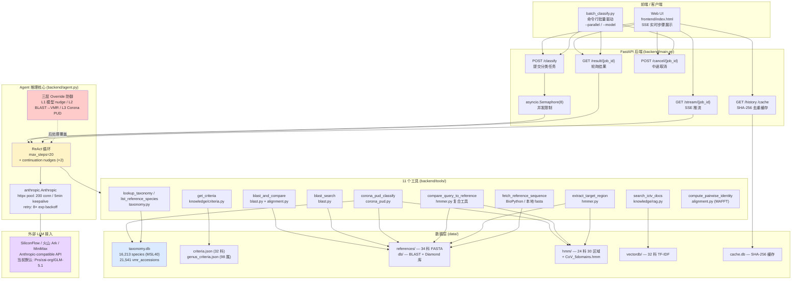
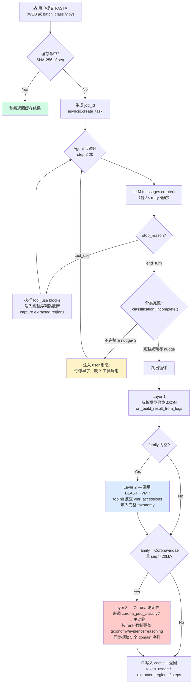
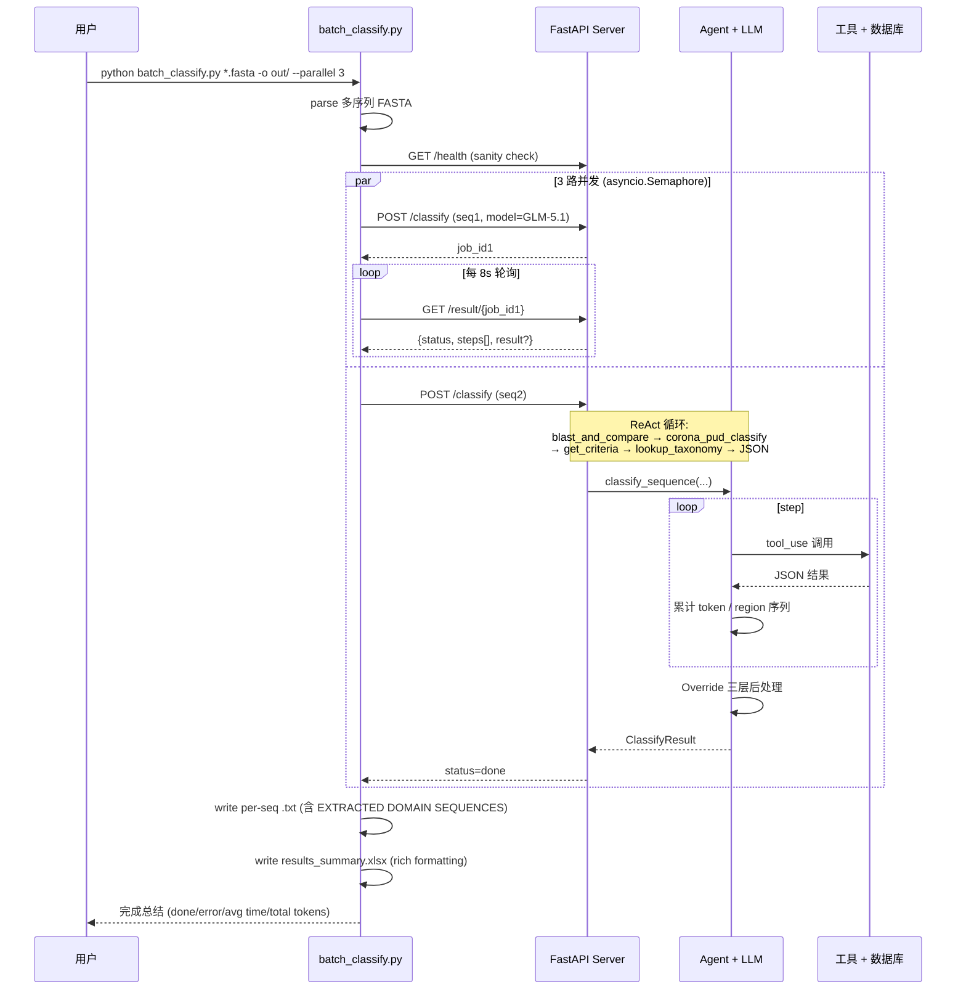
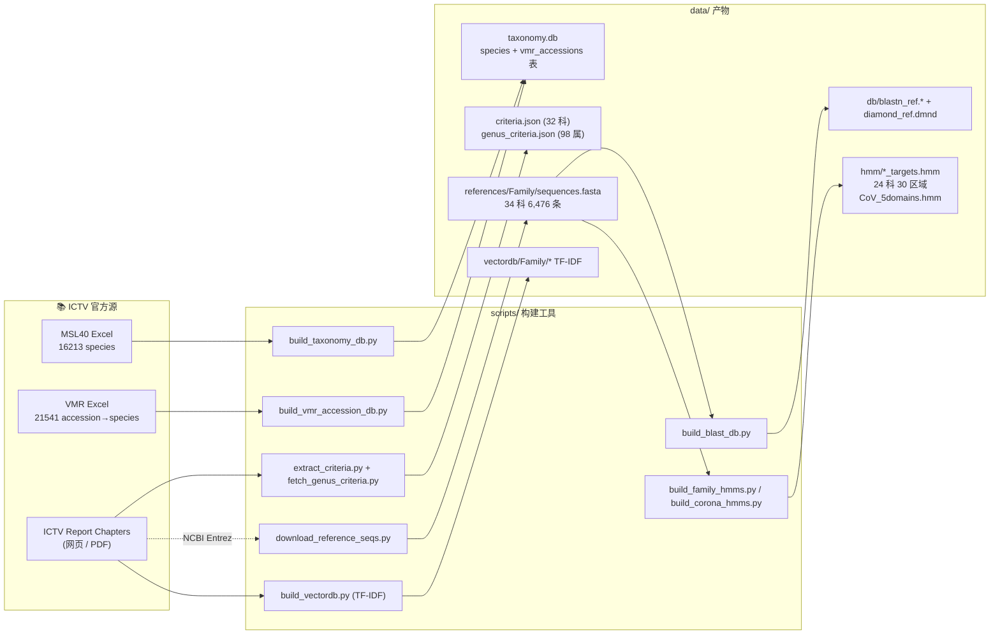

# ICTV 病毒分类智能 Agent — 架构与流程图

本文档以 [Mermaid](https://mermaid.js.org/) 流程图形式呈现 ICTV Agent 的系统架构、单序列分类流程、批量分类时序，以及数据库构建管线。配合 `ICTV病毒分类智能Agent实施方案.md`（设计与开发日志）阅读。

> 📌 **GitHub / VS Code / Obsidian 可直接渲染本文档**。如需 PNG/SVG，可执行：
> ```bash
> npx -p @mermaid-js/mermaid-cli mmdc -i docs/ARCHITECTURE.md -o docs/diagrams/diagram.png
> ```

---

## 一、系统架构（分层视图）



---

## 二、单条序列分类的完整流程



---

## 三、批量分类时序



---

## 四、知识库与参考库构建（一次性预处理）



---

## 五、关键设计要点速查

| 模块 | 文件 | 职责亮点 |
|---|---|---|
| **Agent 核心** | `backend/agent.py` | 11 工具 ReAct 循环 + 3 层 Override + 模型 nudge + token 追踪 |
| **Coronaviridae 专用** | `backend/tools/corona_pud.py` | DEmARC PUD 5 个复制酶结构域 + ORF1ab 移码检测 + VMR 反查 |
| **HMM 区域提取** | `backend/tools/hmmer.py` | aa + nt 双坐标映射，支持 ORF 反向链 |
| **复合工具** | `compare_query_to_reference` | 一步完成 query+ref 区域提取+对齐+identity，避免多轮 chain |
| **缓存** | `backend/cache.py` | SHA-256 of FASTA → 完整结果，Web 端可逐项删除 |
| **批量驱动** | `scripts/batch_classify.py` | 3 路并发 / 自动重试 / Excel rich text / FASTA 段输出提取序列 |
| **抗幻觉** | `agent.py` 末尾 ~150 行 | L1 模型重跑 + L2 BLAST→VMR + L3 Corona 强制覆盖 |
| **数据完备性** | VMR 21,541 条 → genus/subgenus/species 全权威 | 杜绝 `species LIKE '%accession%'` 反查的旧错误 |

---

## 六、API 端点速查（FastAPI / `backend/main.py`）

| 方法 | 路径 | 功能 |
|---|---|---|
| `GET` | `/health` | 健康检查（families 数、并发槽） |
| `POST` | `/classify` | 提交分类任务，body 接受 `fasta`, `family_hint`, `model` |
| `GET` | `/result/{job_id}` | 轮询任务结果（含 steps/result/token_usage） |
| `GET` | `/stream/{job_id}` | SSE 推流，前端实时显示步骤 |
| `POST` | `/cancel/{job_id}` | 中途取消 asyncio.Task |
| `GET` | `/history` | 历史任务列表（最近若干条） |
| `GET` | `/cache/{seq_hash}` | 按 SHA-256 取缓存结果 |
| `GET` | `/families` | 列出有标准的科 |
| `GET` | `/family/{name}` | 单科详细信息 |
| `GET` | `/family/{name}/summary` | 单科 species/genus 计数概览 |
| `GET` | `/species` | 模糊搜索物种 |
| `GET` | `/` | 静态首页（前端 HTML） |

---

## 七、当前默认 LLM 配置（`run.sh`）

```bash
ANTHROPIC_API_KEY="<SiliconFlow key sk-...>"
ANTHROPIC_BASE_URL="https://api.siliconflow.cn"
CLAUDE_MODEL="Pro/zai-org/GLM-5.1"
```

> ⚠️ **`ANTHROPIC_BASE_URL` 只到域名级**——SDK 自动拼接 `/v1/messages`。任何 Anthropic-compatible 平台（火山 Ark / MiniMax / SiliconFlow）皆同此规则。

> ⚠️ **DNS 解析**：若本机 systemd-resolved 无法解析 API 域名，需在 `/etc/hosts` 固定 IP，**不要走代理**（代理会被云服务侧 rate limit）。

切换模型示例（不必重启 server，使用 `--model` 覆盖）：

```bash
# 走 SiliconFlow 的 Kimi K2.6（疑难序列兜底）
python scripts/batch_classify.py input.fasta -o out/ --model Pro/moonshotai/Kimi-K2-Instruct

# 走火山 Ark 的 GLM-4.7（兼容老接入）
ANTHROPIC_BASE_URL=https://ark.cn-beijing.volces.com/api/coding \
ANTHROPIC_API_KEY=<ark-key> bash run.sh
```
